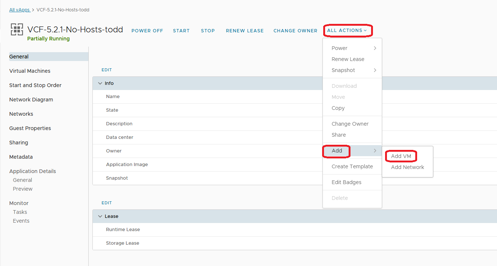
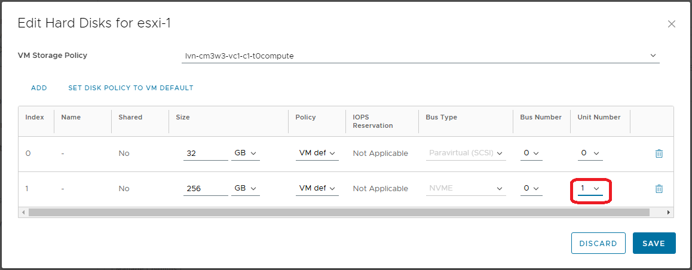

# Using the EPC - VCF 5.2.1 No Hosts - Lab Template

This template only has three VMs.  **Holo-Router**, **Holo-Console** and **VCF 5.2.1 Cloudbuilder**.  

In order to be able to deploy VCF 5.2.1 using this template, you will need to create four ESXi Hosts with the following settings in the vApp

* 128GB RAM
* 12 CPUs (Note.  You want one socket with 12 cores, NOT 12 sockets)
* 1 x 32GB Paravirtual (SCSI) 
* 1 x 256GB NVMe
* 4 x VMXNET3 NICS, connected to vAppNet and set to DHCP Mode

Click **ALL ACTIONS --> Add --> Add VM**

Click **ADD VIRTUAL MACHINE**

* Name: esxi-(1,2,3,4)
* Description: 
* Type: New
* Guest OS Family: Other
* Guest OS: VMware ESXi 8.0 or later

1.

2.

3.

4.

5.

6

7.

Remember to rename it properly

Click **NEXT**

Click **DONE**

Wait for the new VM to be Created

Once that one is created, repeat until you have all the ESXi hosts you need

Once they are created, you need to attach the ESXii installation ISO image VMware-VMvisor-Installer-8.0U3b-24280767.x86_64.iso to virtual CD-ROM

For the installation you install ESXi onto the 32GB drive and set a root password of VMware123!VMware123!

Once installation has completed and the vHosts have rebooted, you’ll need to log into each one and set the following values

Management Network VLAN = 10

Name and IP information is

| FQDN (hostname)     | IP         | SM            | DF         |
| :------------------ | :--------- | :------------ | :--------- |
| esxi-1.vcf.sddc.lab | 10.0.0.101 | 255.255.255.0 | 10.0.0.253 |
| esxi-2.vcf.sddc.lab | 10.0.0.102 | 255.255.255.0 | 10.0.0.253 |
| esxi-3.vcf.sddc.lab | 10.0.0.103 | 255.255.255.0 | 10.0.0.253 |
| esxi-4.vcf.sddc.lab | 10.0.0.104 | 255.255.255.0 | 10.0.0.253 |

DNS Server is 10.0.0.253

You must restart the management network when prompted.

You must enable SSH

Once all of the hosts have been configured, there are two more configuration items to tick off.

Start the vApp in vCloud Director.  Once it has started up, connect to the Holo-Console and use the web browser to log into each host in turn.  Go to services and configure NTP with 10.0.0.253 and set it to start and stop with host.

Finally, use Putty to ssh into each host and re-generate the default certificates using the following commands

CD /etc/vmware/ssl
mv rui.crt orig.rui.crt
mv rui.key orig.rui.key
/sbin/generate-certificates

You need to do this so that the default certificate contains the FQDN of the host.

You are now ready to execute the cloudbuilder process.

Open a browser on the Holo-Console and go to https://10.0.0.253.  The JSON file you need to upload for bringup is in the c:\VLC folder

